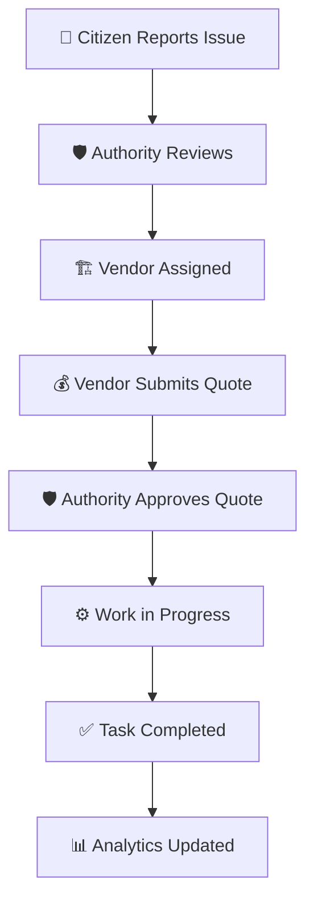

# 🏛️ CivicPulse: Citizen Engagement Portal

<div align="center">


</div>

---

## 🌟 Overview

**CivicPulse** is a robust Java-based participatory platform designed to bridge the gap between citizens and government authorities. It empowers residents to take an active role in their community by reporting issues, proposing solutions, and tracking infrastructure projects in real-time. With a dedicated interface for Authorities and Vendors, it streamlines the entire lifecycle of civic improvement—from the initial report to task completion.

## ✨ Features

### 👥 **For Citizens**

* **Issue Reporting**: Submit local problems (e.g., potholes, sanitation) with unique tracking IDs.
* **Participatory Democracy**: Submit proposals, vote on community initiatives, and leave comments.
* **Grievance Redressal**: File formal complaints directly to authorities and track resolution status.

### 🛡️ **For Authorities**

* **Centralized Management**: Review reported issues and approve community proposals.
* **Vendor Coordination**: Assign tasks to specialized vendors and review cost quotations.
* **Insightful Analytics**: Generate comprehensive reports and view dashboards on city-wide progress.

### 🏗️ **For Vendors**

* **Bidding System**: Submit competitive quotations for assigned civic tasks.
* **Progress Tracking**: Update work status in real-time and mark tasks as "Completed" for authority review.

---

## 🛠️ Technologies Used

| Category | Technology | Purpose |
| --- | --- | --- |
| **Language** | **Java 8+** | Core application logic and object-oriented structure. |
| **GUI Framework** | **Java Swing** | User-friendly desktop interface for all user roles. |
| **Database** | **MySQL** | Persistent storage for users, issues, and assignments. |
| **Connector** | **JDBC** | Secure communication between the Java app and MySQL. |

---

## 🚀 How it Works



1. **Submission**: Citizens use the `CivicPulseGUI` to log issues into the `civic_pulse` database.
2. **Action**: Authorities access the backend logic via `CivicPulse.java` to filter issues by category and assign them to verified Vendors.
3. **Resolution**: Vendors update their progress, which is immediately reflected on the Citizen's personal dashboard.

---

## 💻 Setup and Installation

### 📋 Prerequisites

* **JDK 8 or higher** (JDK 17 recommended)
* **MySQL Server** (5.7+)
* **MySQL JDBC Driver** (`mysql-connector-java-8.0.33.jar`)

### 🔧 Installation Steps

1. **📥 Clone the Repository**:
```bash
git clone https://github.com/YourUsername/CivicPulse.git
cd CivicPulse

```


2. **🗄️ Database Configuration**:
* Log into MySQL and run the schema script:
```sql
SOURCE civic_pulse_schema.sql;

```


* Update your credentials in `src/com/civicpulse/system/CivicPulse.java`:
```java
String password = "your_mysql_password";

```


3. **📦 Add Dependencies**:
* Ensure the `lib/mysql-connector-java-8.0.33.jar` is included in your project's build path.


4. **🚀 Build and Run**:
```bash
# Compile
javac -d bin -sourcepath src -cp lib/mysql-connector-java-8.0.33.jar src/com/civicpulse/gui/CivicPulseGUI.java

# Run
java -cp bin:lib/mysql-connector-java-8.0.33.jar com.civicpulse.gui.CivicPulseGUI

```


---

## 📁 Project Structure

```text
📂 CivicPulseApp/
├── 📂 src/
│   └── 📂 com/civicpulse/
│       ├── 📂 gui/        # Swing-based UI Components
│       ├── 📂 system/     # Backend logic & DB Connectivity
│       ├── 📂 user/       # User Models (Citizen, Vendor, Authority)
│       └── 📂 core/       # Shared Enums and Constants
├── 📂 lib/                # Database Drivers
├── 📜 civic_pulse_schema.sql  # Database structure
└── 📜 README.md           # Project Documentation

```

---

## 🤝 Contributing

We welcome contributions to make our cities smarter! 🏙️

1. **Fork** the project.
2. **Create** your feature branch (`git checkout -b feature/NewFeature`).
3. **Commit** your changes (`git commit -m 'Add some NewFeature'`).
4. **Push** to the branch (`git push origin feature/NewFeature`).
5. **Open** a Pull Request.

---

## 📄 License

This project is licensed under the **MIT License**.

## 💬 Contact

**Maintainers:**

* Ayush Kumar - [2023ayush.kumar@vidyashilp.edu.in](mailto:2023ayush.kumar@vidyashilp.edu.in)
* Pruthvi Raj - [2023pruthvi.raj@vidyashilp.edu.in](mailto:2023pruthvi.raj@vidyashilp.edu.in)

---

<div align="center">
<b>⭐ If you find this project useful, please consider giving it a star! ⭐</b>
</div>
